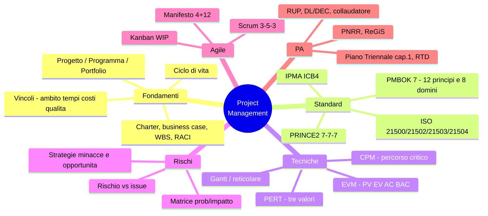

# 1 · Project e Program management

[← Indice](README.md)

## Mappa



## Progetto, programma, portfolio

| Livello | Oggetto | Obiettivo | Successo misurato in |
|---|---|---|---|
| **Progetto** | Sforzo temporaneo | Consegnare un **output/deliverable** | Ambito, tempi, costi, qualità |
| **Programma** | Insieme di progetti correlati | Realizzare **benefici** non ottenibili separatamente | Benefici realizzati e sostenuti |
| **Portfolio** | Insieme di progetti/programmi | Allineamento alla **strategia** | Valore strategico, priorità |

Programma = gestisce incertezza e **cambiamento organizzativo**; progetto = consegna un output.
Ciclo dei benefici: **identification → realization → sustainment**.

## Gruppi di processo e documenti

| Gruppo di processo | Documento tipico |
|---|---|
| Avvio | Project charter, business case, registro stakeholder |
| Pianificazione | WBS, baseline (ambito/tempi/costi), piano di comunicazione, risk register |
| Esecuzione | Deliverable, richieste di modifica |
| Monitoraggio e controllo | Report di avanzamento, EVM, change control |
| Chiusura | Collaudo/accettazione, lezioni apprese |

- **WBS — regola del 100%**: la somma dei livelli figli esprime il 100% del lavoro del padre; nulla in più, nulla in meno.
- **RACI**: Responsible (esegue) · Accountable (risponde, **uno solo**) · Consulted (bidirezionale) · Informed (unidirezionale).

## Standard

| Standard | Struttura da ricordare |
|---|---|
| **PMBOK 7ª ed.** | **12 principi** + **8 domini di performance**: stakeholder, team, approccio di sviluppo e ciclo di vita, pianificazione, lavoro di progetto, consegna, misurazione, incertezza. Passaggio da "per processi" a "per principi" |
| **PRINCE2** | **7 principi, 7 temi, 7 processi**; gestione **per eccezioni**; **business case continuativo** |
| **ISO 21500 / 21502** | Linee guida di project management |
| **ISO 21503** | Program management |
| **ISO 21504** | Portfolio management |
| **IPMA ICB 4** | 3 aree di competenza: **prospettiva, persone, pratica** |

## Tecniche numeriche

### CPM — percorso critico
- Percorso più lungo della rete = **durata minima** del progetto.
- Attività critiche: **float/slack = 0**.
- Float totale = LS − ES = LF − EF.

### PERT — stima a tre valori
```
Te = (O + 4M + P) / 6        (distribuzione beta)
Te = (O + M + P) / 3         (distribuzione triangolare)
```

### Earned Value Management ⭐ materiale da quiz per eccellenza

| Sigla | Significato |
|---|---|
| PV | Planned Value — valore pianificato |
| EV | Earned Value — valore del lavoro effettivamente eseguito |
| AC | Actual Cost — costo effettivo sostenuto |
| BAC | Budget at Completion — budget totale |

| Formula | Lettura |
|---|---|
| `SV = EV − PV` | > 0 in anticipo · < 0 in ritardo |
| `CV = EV − AC` | > 0 sotto budget · < 0 sopra budget |
| `SPI = EV / PV` | **> 1 in anticipo** |
| `CPI = EV / AC` | **> 1 sotto budget** |
| `EAC = BAC / CPI` | Stima del costo finale |
| `ETC = EAC − AC` | Quanto manca da spendere |
| `VAC = BAC − EAC` | > 0 si chiude in risparmio |

**Mnemonica**: le *varianze* sono **differenze** (−), gli *indici* sono **rapporti** (/); si parte sempre da EV. Indice o varianza **> 1 / > 0 = bene**.

### Stime
Analogica (top-down, per analogia, rapida e imprecisa) · Parametrica (per driver: €/mq) · Bottom-up (per attività, precisa e costosa) · Three-point (PERT).

### Canali di comunicazione
```
n(n − 1) / 2        es. 10 persone → 45 canali
```

## Rischi

- **Rischio** = evento *incerto*, futuro · **Issue** = problema *già verificato*.
- Matrice **probabilità / impatto**; **risk appetite** (quanta incertezza si è disposti ad accettare) vs **tolleranza** (soglia misurabile).

| Minacce | Opportunità |
|---|---|
| Evitare (avoid) | Sfruttare (exploit) |
| Trasferire (transfer) | Condividere (share) |
| Mitigare (mitigate) | Migliorare (enhance) |
| Accettare (accept) | Accettare (accept) |
| Escalate | Escalate |

## Stakeholder e PMO

- **Matrice potere/interesse**: alto potere + alto interesse → *gestire da vicino*; alto potere + basso interesse → *mantenere soddisfatto*; basso potere + alto interesse → *tenere informato*; basso/basso → *monitorare*.

| Tipo di PMO | Grado di controllo |
|---|---|
| **Supportivo** | Basso — fornisce template, best practice, repository |
| **Di controllo** | Medio — richiede conformità a metodologie e framework |
| **Direttivo** | Alto — **assume la gestione diretta** dei progetti |

## Agile

- **Manifesto Agile**: **4 valori, 12 principi**.

### Scrum — regola 3-5-3

| Ruoli (3) | Eventi (5) | Artefatti (3) | Commitment |
|---|---|---|---|
| Product Owner | Sprint (contenitore) | Product Backlog | Product Goal |
| Scrum Master | Sprint Planning | Sprint Backlog | Sprint Goal |
| Developers | Daily Scrum | Increment | Definition of Done |
| | Sprint Review | | |
| | Sprint Retrospective | | |

Sprint **≤ 1 mese**; ogni evento è in **timebox**; il Daily è quotidiano e breve.

- **Kanban**: visualizzazione del flusso, **limiti WIP**, *lead time* (dalla richiesta alla consegna) vs *cycle time* (dall'inizio della lavorazione alla consegna).
- **Ibridi**: predittivo quando requisiti stabili e vincoli normativi forti; adattivo quando requisiti incerti e feedback frequente.

## Declinazione nella PA ⭐ specificità del profilo

- **PNRR**: **milestone** (qualitativi) e **target** (quantitativi), cronoprogrammi, sistema **ReGiS**, monitoraggio **fisico-procedurale-finanziario**, rendicontazione.
- **Codice dei contratti**: **RUP** (responsabile unico del progetto), direttore dei lavori / direttore dell'esecuzione (DEC), collaudatore.
- **Piano Triennale, cap. 1** — organizzazione e gestione del cambiamento; ruolo del **RTD** (art. 17 CAD).

## Trappole d'esame

- **SPI/CPI > 1 = bene** (anticipo/risparmio): non invertire.
- **EAC = BAC/CPI** usa l'indice di *costo*, non di *schedule*.
- Nel **programma** si misurano i *benefici*, nel progetto i *deliverable*.
- **Accountable è uno solo** nella RACI.
- Lo **Sprint** è un evento contenitore, non una fase; la Retrospective chiude lo sprint.
- Il **Product Owner** gestisce il Product Backlog, non lo Scrum Master.
- PMBOK 7 non ha più i "processi": ha **principi e domini**.

## Autoverifica

<details><summary>EV=800, PV=1000, AC=900, BAC=2000. SPI, CPI, EAC?</summary>

SPI = 800/1000 = **0,8** (in ritardo) · CPI = 800/900 ≈ **0,89** (sopra budget) ·
EAC = 2000/0,89 ≈ **2250** · VAC = 2000 − 2250 = **−250** (sforamento atteso).
</details>

<details><summary>Attività con O=4, M=6, P=14: stima PERT?</summary>

(4 + 4·6 + 14)/6 = 42/6 = **7**.
</details>

<details><summary>Quanti canali di comunicazione con 8 stakeholder?</summary>

8·7/2 = **28**.
</details>

<details><summary>PRINCE2: quanti principi, temi e processi?</summary>

**7 principi, 7 temi, 7 processi**; principio cardine il *business case continuativo* e la *gestione per eccezioni*.
</details>

<details><summary>Strategia per un'opportunità che voglio rendere certa?</summary>

**Sfruttare (exploit)** — l'equivalente speculare di *evitare* per le minacce.
</details>

## Fonti

- *PMBOK Guide*, 7ª ed., PMI (o buona sintesi manualistica)
- ISO 21502:2020 — sintesi online
- Formez PA / Syllabus "Competenze digitali per la PA"
- [Piano Triennale 2024-2026, agg. 2026, cap. 1](https://www.agid.gov.it)
- [italiadomani.gov.it](https://www.italiadomani.gov.it) — governance progetti PNRR

## Checklist di padronanza

- [ ] Formule EVM a memoria, con interpretazione
- [ ] PERT e CPM su esercizi numerici
- [ ] PMBOK 7: 12 principi e 8 domini
- [ ] PRINCE2 7-7-7
- [ ] Scrum 3-5-3 + timebox
- [ ] Strategie rischio (minacce/opportunità)
- [ ] Tipi di PMO e matrice potere/interesse
- [ ] Milestone vs target e ruolo di ReGiS
