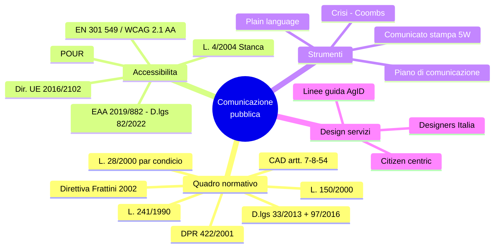

# 2 · Comunicazione pubblica e istituzionale

[← Indice](README.md)

## Mappa

## L. 7 giugno 2000, n. 150 — la distinzione fondante

| | **Attività di INFORMAZIONE** | **Attività di COMUNICAZIONE** |
|---|---|---|
| Destinatari | **Mezzi di comunicazione di massa** | **Cittadini e utenti** |
| Strutture | **Portavoce (art. 7)**, **Ufficio stampa (art. 9)** | **URP (art. 8)** |
| Professionalità | Capo ufficio stampa **iscritto all'albo dei giornalisti** | Comunicatore pubblico |

- **Art. 7 — Portavoce**: rapporti di carattere politico-istituzionale con gli organi di informazione; nominato dall'organo di vertice; incompatibile con l'esercizio dell'attività giornalistica professionale.
- **Art. 8 — URP**: informazione all'utenza, accesso, ascolto dei cittadini, verifica della qualità e del gradimento, comunicazione interna e interconnessione fra uffici.
- **Art. 9 — Ufficio stampa**: rapporti con i mezzi di informazione, in via esclusiva.
- **DPR 422/2001**: titoli e requisiti professionali per informazione e comunicazione.
- **Direttiva Frattini (7 febbraio 2002)**: attività di comunicazione delle PA, **piano annuale di comunicazione**.

## Trasparenza e accesso — tre regimi da non confondere ⭐

| | **Accesso documentale** | **Accesso civico semplice** | **Accesso civico generalizzato (FOIA)** |
|---|---|---|---|
| Fonte | **L. 241/1990, artt. 22 ss.** | **D.lgs. 33/2013, art. 5 c.1** | **D.lgs. 33/2013, art. 5 c.2** (introdotto dal **D.lgs. 97/2016**) |
| Legittimazione | Interesse **diretto, concreto e attuale** | **Chiunque** | **Chiunque** |
| Motivazione | **Richiesta** | Non richiesta | Non richiesta |
| Oggetto | Documenti amministrativi | Documenti **soggetti a pubblicazione obbligatoria** e non pubblicati | **Dati e documenti ulteriori** rispetto a quelli obbligatori |
| Limiti | Art. 24 L. 241/1990 | — | **Art. 5-bis**: esclusioni assolute e limiti relativi (interessi pubblici e privati) |

Altri elementi: sezione **"Amministrazione trasparente"**, **RPCT** (responsabile prevenzione corruzione e trasparenza), **Circolare FOIA n. 2/2017** del Ministro per la PA, linee guida ANAC.

## Altre norme chiave

| Norma | Contenuto |
|---|---|
| **L. 241/1990** | Trasparenza dell'azione amministrativa, responsabile del procedimento, **comunicazione di avvio del procedimento**, accesso |
| **L. 28/2000 (par condicio), art. 9** | In periodo elettorale **divieto di comunicazione istituzionale**, salvo quella **indispensabile** per l'efficace svolgimento delle funzioni e **in forma impersonale** |
| **CAD art. 54** | Contenuti dei siti istituzionali |
| **CAD art. 7** | Diritto a servizi online **di qualità** |
| **CAD art. 8** | Alfabetizzazione digitale |

## Accessibilità ⭐ alta probabilità

| Fonte | Cosa dice |
|---|---|
| **L. 9 gennaio 2004, n. 4 ("Stanca")** | Accessibilità degli strumenti informatici; estesa a organismi di diritto pubblico e **grandi operatori privati** |
| **Direttiva (UE) 2016/2102** | Accessibilità di siti web e app mobili degli enti pubblici |
| **European Accessibility Act — Dir. (UE) 2019/882** | Recepita con **D.lgs. 82/2022**: accessibilità di prodotti e servizi anche privati |
| **EN 301 549** | Standard europeo di riferimento |
| **WCAG 2.1 livello AA** | Livello di conformità richiesto |

**POUR** — i 4 principi WCAG:
**P**ercepibile · **U**tilizzabile (operable) · **C**omprensibile (understandable) · **R**obusto.

Adempimenti annuali:

| Scadenza | Adempimento |
|---|---|
| **31 marzo** | **Obiettivi di accessibilità** |
| **23 settembre** | **Dichiarazione di accessibilità** |

Più: **meccanismo di feedback** per gli utenti e **vigilanza di AgID**.

## Cassetta degli attrezzi

**Piano di comunicazione**: analisi del contesto → obiettivi **SMART** → pubblici e segmentazione → messaggi chiave → canali → budget → cronoprogramma → **valutazione**.

**Modelli e teorie**: emittente–messaggio–destinatario, feedback, rumore; comunicazione a una via vs a due vie; **agenda setting** (i media non dicono *cosa pensare* ma *su cosa pensare*), **framing** (come viene incorniciato il tema), **gatekeeping** (selezione delle notizie).

**Media relations**: comunicato stampa a **piramide rovesciata** con le **5W** (*who, what, when, where, why* + *how*), conferenza stampa, media kit, intervista, rassegna stampa.

**Comunicazione di crisi**:
- Fasi: **pre-crisi** (prevenzione, piano, formazione) → **crisi** (risposta) → **post-crisi** (valutazione, follow-up).
- Principi: **portavoce unico**, tempestività, trasparenza, **holding statement** (prima dichiarazione interlocutoria in attesa di dati certi).
- **Modello situazionale di Coombs (SCCT)**: la strategia di risposta si sceglie in base al livello di **attribuzione di responsabilità** all'organizzazione (vittima → incidentale → prevenibile).

**Linguaggio amministrativo**: chiarezza, **plain language**, **Codice di stile** (1993) e **Manuale di stile** (1997), indici di leggibilità.

**Comunicazione interna e change management**: la comunicazione come leva della trasformazione digitale.

**Fondi europei**: obblighi di **informazione e visibilità** ex **art. 34 Reg. (UE) 2021/241**; emblema UE e dicitura **"Finanziato dall'Unione europea – NextGenerationEU"**.

## Design dei servizi pubblici

- **Linee guida di design per i servizi digitali della PA** (AgID), **Designers Italia**, modelli di siti per **comuni e scuole**.
- Content design, architettura dell'informazione, approccio **citizen-centric**, user research, **test di usabilità**, misurazione della soddisfazione.

## Trappole d'esame

- **Informazione → media / Comunicazione → cittadini**: è la domanda più ricorrente sulla L. 150/2000.
- L'**iscrizione all'albo dei giornalisti** riguarda il **capo ufficio stampa**, non il responsabile URP.
- L'accesso **documentale** richiede l'interesse qualificato; il **FOIA** no.
- Il FOIA nasce con il **D.lgs. 97/2016** che modifica il D.lgs. 33/2013, non con una legge autonoma.
- WCAG **2.1 livello AA** (non AAA).
- Le due scadenze di accessibilità si invertono facilmente: **obiettivi 31 marzo, dichiarazione 23 settembre**.
- In campagna elettorale la comunicazione istituzionale non è vietata *in assoluto*: è ammessa se **indispensabile e impersonale**.

## Autoverifica

Chi può chiedere l'accesso civico generalizzato e con quale motivazione?

**Chiunque, senza motivazione e senza dimostrare un interesse**; limiti ed esclusioni all'**art. 5-bis** del D.lgs. 33/2013.

Art. 7, 8 e 9 della L. 150/2000: a cosa corrispondono?

7 = **portavoce** · 8 = **URP** · 9 = **ufficio stampa**.

Quali sono i 4 principi WCAG?

**POUR**: percepibile, utilizzabile, comprensibile, robusto.

Cosa prevede l'art. 9 della L. 28/2000?

Nei periodi elettorali è vietata alle PA ogni attività di comunicazione istituzionale, **salvo quella indispensabile per l'assolvimento delle proprie funzioni e comunque in forma impersonale**.

Che cos'è un holding statement?

Una dichiarazione interlocutoria diffusa nelle primissime fasi della crisi, che riconosce l'accaduto e dichiara che sono in corso verifiche, in attesa di informazioni consolidate. Serve a occupare lo spazio informativo senza affermare fatti non verificati.

## Fonti

- [normattiva.it](https://www.normattiva.it): L. 150/2000, DPR 422/2001, L. 241/1990, D.lgs. 33/2013, L. 4/2004, L. 28/2000
- Direttiva Frattini 2002 — funzionepubblica.gov.it
- [docs.italia.it](https://docs.italia.it) e agid.gov.it — linee guida design e accessibilità
- [designers.italia.it](https://designers.italia.it)
- ANAC — delibere e linee guida FOIA; Circolare FOIA n. 2/2017

## Checklist di padronanza

- [ ] Distinzione informazione/comunicazione e articoli della L. 150/2000
- [ ] Tabella dei tre regimi di accesso
- [ ] Catena accessibilità: L. 4/2004 → 2016/2102 → EAA/D.lgs. 82/2022 → EN 301 549 → WCAG 2.1 AA
- [ ] Le due scadenze annuali di accessibilità
- [ ] Fasi e principi della comunicazione di crisi
- [ ] Obblighi di visibilità art. 34 Reg. 2021/241
