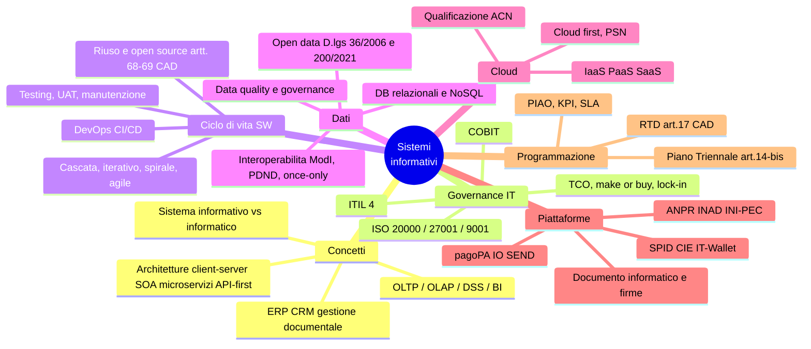

# 3 · Principi di gestione dei sistemi informativi

[← Indice](README.md)

## Mappa

## Concetti fondamentali

- **Sistema informativo** = insieme di persone, procedure, dati e tecnologie che gestisce le informazioni di un'organizzazione. **Sistema informatico** = la sola componente automatizzata (hardware/software). Il secondo è un sottoinsieme del primo.
- **Dato → informazione → conoscenza**: il dato è grezzo, l'informazione è dato contestualizzato, la conoscenza è informazione interpretata e applicabile.

| Tipo di sistema | Funzione |
|---|---|
| **OLTP** (transazionale) | Operazioni correnti, molte scritture, dati aggiornati al momento |
| **OLAP / DSS / BI** (direzionale) | Analisi multidimensionale, supporto alle decisioni, dati storici |
| **ERP** | Integrazione dei processi gestionali |
| **CRM** | Relazione con l'utente/cliente |
| **Gestione documentale / workflow** | Documenti e flussi di processo |

**Architetture**: client-server · a livelli (**three-tier**: presentazione, logica, dati) · **SOA** · **microservizi** · **API-first** · **event-driven**. Monolite (unico deployable, semplice ma rigido) vs modulare/microservizi (scalabilità e rilasci indipendenti, maggiore complessità operativa).

## Governance e gestione dei servizi IT

**ITIL 4** — *Service Value System*, **catena del valore del servizio**. Pratiche più citate:

| Pratica | Scopo |
|---|---|
| **Incident management** | Ripristinare il servizio **il prima possibile** |
| **Problem management** | Individuare e rimuovere la **causa radice** |
| **Change enablement** | Gestire le modifiche minimizzando il rischio |
| **Service request** | Richieste standard e preautorizzate |
| **Service desk** | Punto unico di contatto |
| **Service level management** | Definire e misurare i livelli di servizio |

| Accordo | Tra chi |
|---|---|
| **SLA** | Fornitore ↔ **cliente** |
| **OLA** | **Interno** all'organizzazione fornitrice |
| **UC** (Underpinning Contract) | Fornitore ↔ **fornitore terzo** |

Altri framework: **COBIT** (distingue **governance** — valutare, indirizzare, monitorare — da **management**); **ISO/IEC 20000** (gestione servizi IT); **ISO/IEC 27001** (sicurezza delle informazioni); **ISO 9001** (qualità).
Economia dell'IT: **TCO**, **make or buy**, gestione dei fornitori, **vendor lock-in**.

## Ciclo di vita del software

Modelli: a cascata · incrementale · iterativo · a spirale (guidato dal rischio) · agile.

Fasi: requisiti (**funzionali** = cosa fa / **non funzionali** = come si comporta: prestazioni, sicurezza, usabilità) → progettazione → sviluppo → **testing** → rilascio → manutenzione.

| Test | Oggetto |
|---|---|
| Unit | Singolo componente |
| Integrazione | Interazione fra componenti |
| Sistema | Sistema completo |
| **Accettazione / UAT** | Verifica da parte dell'utente/committente |
| Regressione | Che le modifiche non abbiano rotto il preesistente |

| Manutenzione | Perché |
|---|---|
| **Correttiva** | Rimuovere difetti |
| **Adattativa** | Adeguare a un ambiente/norma che cambia |
| **Evolutiva** | Aggiungere funzionalità |
| **Perfettiva** | Migliorare prestazioni e manutenibilità |

**DevOps**, CI/CD, controllo di versione, ambienti **sviluppo/test/produzione**, collaudo.
**Riuso e open source**: **artt. 68 e 69 CAD** — obbligo di **valutazione comparativa** prima dell'acquisizione, preferenza per soluzioni a riuso/open source, obbligo di rendere riusabile il software sviluppato per conto della PA; piattaforma **Developers Italia**.

## Dati e interoperabilità

- **Relazionali**: chiavi primarie/esterne, normalizzazione, SQL, transazioni **ACID** (Atomicity, Consistency, Isolation, Durability). **NoSQL** per volumi e schemi flessibili.
- **Data warehouse** (strutturato, schema-on-write) vs **data lake** (grezzo, schema-on-read); **ETL**; data mart.
- **Data quality**: accuratezza, completezza, coerenza, tempestività, unicità, validità. Più data governance, metadati, **data steward**.

### Open data

- **D.lgs. 36/2006** come modificato dal **D.lgs. 200/2021** (recepimento **Direttiva (UE) 2019/1024 Open Data**).
- Principio **"aperti per definizione"** (*open by default*); formati aperti; licenze **CC-BY**, **IODL**.
- **Dataset di elevato valore** (*high value datasets*) — **Reg. di esecuzione (UE) 2023/138**.
- Portale **dati.gov.it**.

### Interoperabilità

- **ModI** — Modello di interoperabilità (AgID).
- **PDND — Piattaforma Digitale Nazionale Dati**, **art. 50-ter CAD**: catalogo di API/e-service per lo scambio di dati fra amministrazioni.
- Principio **once-only**: il cittadino fornisce un dato **una sola volta**; la PA se lo scambia.
- **European Interoperability Framework**; **Interoperable Europe Act — Reg. (UE) 2024/903**.
- **Data Governance Act — Reg. (UE) 2022/868** · **Data Act — Reg. (UE) 2023/2854**.

## Cloud

| Modelli di servizio | Cosa gestisce il fornitore |
|---|---|
| **IaaS** | Infrastruttura (server, storage, rete) |
| **PaaS** | + runtime e middleware |
| **SaaS** | + applicazione completa |

Deployment: pubblico · privato · **ibrido** · community.
**5 caratteristiche essenziali NIST**: self-service on demand · accesso in rete (broad network access) · **pooling** delle risorse · **elasticità** rapida · servizio **misurabile**.

Nella PA: strategia **cloud first** · **Polo Strategico Nazionale (PSN)** · classificazione di dati e servizi (ordinari/critici/strategici) · **qualificazione dei servizi cloud**, competenza passata da **AgID all'ACN** · percorsi di migrazione · **portabilità e reversibilità** dei dati.

## Piattaforme abilitanti ⭐ cuore operativo del DTD

| Ambito | Piattaforme / norme |
|---|---|
| **Identità** | **SPID**, **CIE**, **art. 64 CAD**; **eIDAS 2 — Reg. (UE) 2024/1183**; **IT-Wallet / EUDI Wallet** |
| **Anagrafiche e domicilio digitale** | **ANPR**; **INAD** (persone fisiche/professionisti) e **INI-PEC** (imprese e professionisti); **artt. 3-bis e 6-quater CAD** |
| **Pagamenti e notifiche** | **pagoPA**, **App IO**, **SEND** (piattaforma notifiche digitali) |
| **Dati** | **PDND** |

### Documento informatico e firme

| Articolo CAD | Contenuto |
|---|---|
| **Art. 20** | Validità e efficacia probatoria del documento informatico |
| **Art. 21** | Documento sottoscritto con firma elettronica |
| **Art. 23-ter** | Documenti amministrativi informatici, copie e duplicati |
| **Art. 24** | Firma digitale |

Gerarchia delle firme: **elettronica semplice** → **avanzata (FEA)** → **qualificata (FEQ)** → **digitale** (firma qualificata basata su certificato qualificato e crittografia asimmetrica). Più: **sigillo elettronico** (persone giuridiche), **marca temporale** (validazione temporale).
**Linee guida AgID** su formazione, gestione e conservazione dei documenti informatici; **protocollo informatico**; **responsabile della conservazione**; **manuale di gestione**.

## Ruoli e programmazione

- **RTD — Responsabile per la transizione digitale**, **art. 17 CAD**: ufficio per la transizione al digitale, dirigente apicale, coordinamento della trasformazione digitale dell'ente.
- **Piano Triennale per l'informatica nella PA**, **art. 14-bis CAD**: approvato con **DPCM**, redatto da AgID con il DTD. Capitoli: organizzazione e gestione del cambiamento · procurement · servizi · dati · piattaforme · infrastrutture · interoperabilità · sicurezza · **strumenti**.
  - Edizione **2024-2026**, **aggiornamento 2026** approvato con **DPCM 4 settembre 2025**, pubblicato il **22 ottobre 2025**. Novità: **AgID Academy**, **IT-Wallet**, **intelligenza artificiale**, monitoraggio della gestione documentale, sezione **"Strumenti" (22 strumenti)**.
- **PIAO** — Piano integrato di attività e organizzazione, con sezione dedicata alla trasformazione digitale.
- Misurazione: KPI, SLA, indicatori del Piano Triennale, **Web Analytics Italia**.

## Trappole d'esame

- **Sistema informativo ≠ sistema informatico**.
- **Incident** = ripristino rapido · **Problem** = causa radice. Non confonderli.
- **SLA** verso il cliente, **OLA** interno, **UC** verso terzi.
- La **qualificazione dei servizi cloud** oggi è dell'**ACN**, non più di AgID.
- **PDND = art. 50-ter CAD**; **RTD = art. 17**; **Piano Triennale = art. 14-bis**; **riuso/open source = artt. 68-69**.
- **INAD** ≠ **INI-PEC**: il primo è l'indice dei domicili digitali delle persone fisiche, il secondo delle imprese e dei professionisti.
- Il Piano Triennale si approva con **DPCM**.

## Autoverifica

Quali sono le 5 caratteristiche essenziali del cloud secondo il NIST?

Self-service on demand · accesso in rete · pooling delle risorse · elasticità rapida · servizio misurabile.

Quale articolo del CAD istituisce la PDND e a cosa serve?

**Art. 50-ter**: piattaforma nazionale per l'interoperabilità dei dati fra PA tramite API/e-service, abilitante del principio **once-only**.

Differenza fra firma elettronica qualificata e firma digitale?

La **firma digitale** è una specie di firma elettronica qualificata basata su un sistema di chiavi crittografiche asimmetriche (pubblica/privata) che consente di verificare provenienza e integrità del documento. Ogni firma digitale è qualificata, non ogni firma qualificata è "digitale" in senso tecnico.

Cosa impongono gli artt. 68-69 CAD prima di acquistare software?

Una **valutazione comparativa** delle soluzioni disponibili (sviluppo interno, riuso, open source, SaaS, licenza proprietaria) con preferenza per riuso e open source, e l'obbligo di rendere riusabile il software sviluppato su commessa pubblica.

Con quale atto si approva il Piano Triennale?

**DPCM** (art. 14-bis CAD). L'aggiornamento 2026 è stato approvato con DPCM 4 settembre 2025.

## Fonti

- **CAD — D.lgs. 82/2005** su normattiva.it. Articoli minimi: **1, 3, 3-bis, 5, 6-quater, 7, 8, 12, 14-bis, 15, 17, 20-24, 40-44, 50, 50-ter, 51, 62-65, 68-69, 71**
- **Piano Triennale 2024-2026, aggiornamento 2026** — agid.gov.it (introduzione, obiettivi, capitoli dati / piattaforme / interoperabilità / sicurezza)
- Linee guida AgID su [docs.italia.it](https://docs.italia.it)
- developers.italia.it · dati.gov.it · pdnd.pagopa.it · acn.gov.it

## Checklist di padronanza

- [ ] Tabella articoli CAD ↔ istituti
- [ ] ITIL: incident/problem/change + SLA/OLA/UC
- [ ] Modelli cloud e caratteristiche NIST
- [ ] Piattaforme abilitanti e norme di riferimento
- [ ] Gerarchia delle firme elettroniche
- [ ] Struttura e novità del Piano Triennale agg. 2026
- [ ] Open data: catena normativa e HVD
