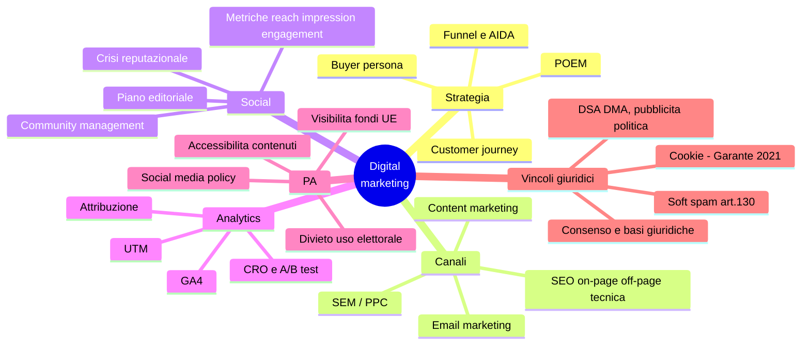

# 4 · Digital marketing e social media

[← Indice](README.md)

## Mappa

## Funnel e strategia

| Fase del funnel | Obiettivo | Metriche tipiche |
|---|---|---|
| **Awareness** | Farsi conoscere | Impression, reach, copertura |
| **Consideration** | Far valutare | CTR, tempo sulla pagina, visite |
| **Conversion** | Far agire | Conversioni, CPA, tasso di conversione |
| **Retention / Loyalty** | Far tornare | Tasso di ritorno, churn, NPS |

- **AIDA**: Attention → Interest → Desire → Action.
- **Buyer persona**: profilo semi-fittizio del destinatario tipo. Nella PA: *utente tipo / persona*.
- **Customer journey** e **touchpoint**; **omnicanalità** (esperienza integrata fra canali, ≠ multicanalità = canali presenti ma separati).
- **POEM**: **P**aid (a pagamento) · **O**wned (canali propri: sito, newsletter, account) · **E**arned (guadagnati: passaparola, citazioni, rassegna stampa).
- Obiettivi **SMART**: Specifici, Misurabili, Raggiungibili (Achievable), Rilevanti, Temporizzati.

## SEO

| Ambito | Elementi |
|---|---|
| **On-page** | Title, meta description, heading (H1-H6), qualità dei contenuti, link interni |
| **Off-page** | Backlink, autorevolezza del dominio, menzioni |
| **Tecnica** | Crawling, indicizzazione, **sitemap.xml**, **robots.txt**, velocità, **mobile-first**, **Core Web Vitals** |

Più: **keyword research**, **intento di ricerca** (informazionale, navigazionale, transazionale, commerciale), **SERP**, **featured snippet**.

## SEM / PPC — sigle da sapere a memoria

| Sigla | Formula / significato |
|---|---|
| **CPC** | Costo per click = spesa / click |
| **CPM** | Costo per **mille** impression |
| **CPA** | Costo per acquisizione (per conversione) |
| **CTR** | Click / impression × 100 |
| **ROAS** | Ricavi da adv / spesa pubblicitaria |
| **Quality score** | Punteggio di qualità dell'annuncio (pertinenza, CTR atteso, esperienza sulla landing) |

Più: campagne **search** vs **display**, **keyword match type** (generica, a frase, esatta), budget e bidding, **remarketing/retargeting**, **programmatic advertising**.

## Content ed email

- **Content marketing / inbound**: blog, video, podcast, **calendario editoriale**, **pillar content**, storytelling.
- **Email**: **DEM** (comunicazione promozionale singola) vs **newsletter** (periodica, di relazione); lista e segmentazione; **deliverability**; metriche: **open rate**, **CTR**, **bounce rate** (soft/hard), **unsubscribe rate**; **A/B test**; **marketing automation** e **lead nurturing**.

## Social media

- Logiche e pubblici delle piattaforme; **algoritmi di ranking** e **reach organica** in calo strutturale.
- **Piano editoriale**, **tone of voice**, formati (post, stories, reel, live), frequenza, **community management**, moderazione.

| Metrica | Definizione |
|---|---|
| **Impression** | Numero di **volte** in cui il contenuto è stato mostrato (anche più volte alla stessa persona) |
| **Reach** | Numero di **persone uniche** raggiunte |
| **Engagement rate** | Interazioni / reach × 100 (oppure / follower × 100) |
| **Share of voice** | Quota di conversazione rispetto ai competitor/temi |
| **Sentiment** | Polarità delle menzioni |

**Vanity metrics** (follower, like nudi) vs **metriche azionabili** (conversioni, engagement rate su reach, costo per risultato).
Più: **social listening**, influencer marketing, **UGC**, advocacy, gestione della crisi reputazionale.

## Analytics

- **GA4**: modello a **eventi** (non più a sessioni come UA); utenti, sessioni, eventi, conversioni, engagement rate, canali di acquisizione.
- **Parametri UTM**: `utm_source`, `utm_medium`, `utm_campaign`, `utm_term`, `utm_content` → tracciano la provenienza del traffico.
- **Modelli di attribuzione**: **last click** (tutto all'ultimo touchpoint), **first click**, **lineare**, **time decay**, **data-driven**.
- **CRO** (ottimizzazione del tasso di conversione) e **A/B testing**; funnel di conversione; dashboard e reportistica.

## Specificità della comunicazione digitale pubblica

- **Social media policy** interna (regole per il personale) ed esterna (regole per gli utenti: netiquette, moderazione, casi di rimozione).
- Gestione dei commenti in equilibrio con la **libertà di espressione**: la rimozione va motivata e ancorata alla policy.
- **Account istituzionale vs account personale** del funzionario: distinzione di ruolo e responsabilità.
- **Accessibilità dei contenuti social**: testi alternativi alle immagini, **sottotitoli** ai video, uso corretto di emoji (lette dagli screen reader) e hashtag in **CamelCase**.
- **Divieto di comunicazione istituzionale a fini elettorali**; imparzialità e neutralità.
- Campagne di pubblica utilità; **obblighi di visibilità dei fondi UE** (art. 34 Reg. 2021/241).

## Vincoli giuridici ⭐ spesso incrociati con la privacy

- **Base giuridica** del trattamento per marketing: di norma **consenso**, che deve essere **libero, specifico, informato, inequivocabile** e **revocabile** in ogni momento con la stessa facilità con cui è stato prestato.
- **Cookie**: **Direttiva ePrivacy**, **art. 122 Codice privacy**, **Linee guida del Garante del 10 giugno 2021**:

| Regola | Contenuto |
|---|---|
| Cookie **tecnici** | Nessun consenso, solo informativa |
| Cookie di **profilazione** / analytics non anonimizzati | **Consenso preventivo** |
| **Scrolling** | **Non equivale a consenso** (salvo condizioni molto specifiche) |
| **Cookie wall** | **Vietato** (salvo alternativa effettiva) |
| Banner | Deve consentire di **rifiutare** con la stessa facilità con cui si accetta; niente pre-spunte |
| Riproposizione del banner | Non prima di **6 mesi** dal rifiuto |

- **Soft spam — art. 130, comma 4, Codice privacy**: email su **prodotti/servizi analoghi** a clienti già acquisiti, senza consenso, purché **informati** e con possibilità di **opporsi** a ogni invio.
- **Profilazione e art. 22 GDPR**; trasferimenti extra-UE verso le piattaforme (**Data Privacy Framework**, **clausole contrattuali standard**).
- **DSA — Reg. (UE) 2022/2065**: trasparenza della pubblicità, divieto di **dark pattern**, obblighi delle piattaforme, **notice and action**, obblighi rafforzati per le **VLOP**.
- **DMA — Reg. (UE) 2022/1925**: obblighi e divieti per i **gatekeeper**.
- **Reg. (UE) 2024/900**: trasparenza della **pubblicità politica**.
- **AI Act**: trasparenza sui contenuti generati artificialmente e sui **deepfake**.
- **AGCM**: pratiche commerciali scorrette, pubblicità ingannevole, disciplina degli **influencer**.

## Trappole d'esame

- **Reach = persone**, **impression = visualizzazioni**. Le impression sono sempre ≥ reach.
- **CPM** = costo per **mille**, non per una.
- **ROAS** è un rapporto ricavi/spesa; il **ROI** considera anche i costi complessivi.
- Lo **scrolling non è consenso** e il **cookie wall è vietato**.
- Il **soft spam** è un'eccezione limitata: prodotti **analoghi**, clienti **già acquisiti**, con opt-out.
- **DSA ≠ DMA**: il primo riguarda contenuti e trasparenza, il secondo la concorrenza dei gatekeeper.
- GA4 è **event-based**, non session-based.

## Autoverifica

Un post ha 20.000 impression, 8.000 reach, 400 interazioni. Engagement rate?

Su reach: 400/8.000 = **5%**. Su impression: 400/20.000 = 2%. Specifica sempre il denominatore.

Spesa 2.000 €, 500 click, 25 conversioni, ricavi 6.000 €. CPC, CPA, ROAS?

CPC = 2.000/500 = **4 €** · CPA = 2.000/25 = **80 €** · ROAS = 6.000/2.000 = **3** (300%).

Quando i cookie non richiedono consenso?

Quando sono **tecnici** (necessari alla trasmissione o strettamente necessari a fornire il servizio richiesto); resta l'obbligo di informativa. Gli analytics richiedono consenso salvo che siano resi equivalenti ai tecnici con misure di minimizzazione.

Che cosa vieta il DSA in materia di interfacce?

I **dark pattern**: interfacce che distorcono o ostacolano la capacità dei destinatari di compiere scelte libere e informate.

Un funzionario può gestire l'account istituzionale come un profilo personale?

No: l'account istituzionale impegna l'amministrazione, richiede imparzialità, tono e contenuti coerenti con la social media policy, e nei periodi elettorali soggiace ai limiti della comunicazione istituzionale.

## Fonti

- Linee guida di design per i servizi web della PA, sezione contenuti — [docs.italia.it](https://docs.italia.it)
- [garanteprivacy.it](https://www.garanteprivacy.it) — Linee guida cookie 2021 e FAQ
- [eur-lex.europa.eu](https://eur-lex.europa.eu) — DSA, DMA, Reg. 2024/900
- Un manuale aggiornato di digital marketing per definizioni e sigle

## Checklist di padronanza

- [ ] Tutte le sigle metriche con la formula
- [ ] Reach vs impression e formule di engagement
- [ ] SEO on-page / off-page / tecnica
- [ ] Regole del Garante sui cookie (2021)
- [ ] Soft spam art. 130 c. 4
- [ ] DSA vs DMA
- [ ] Regole della comunicazione social nella PA
