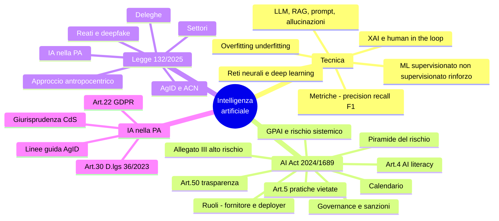
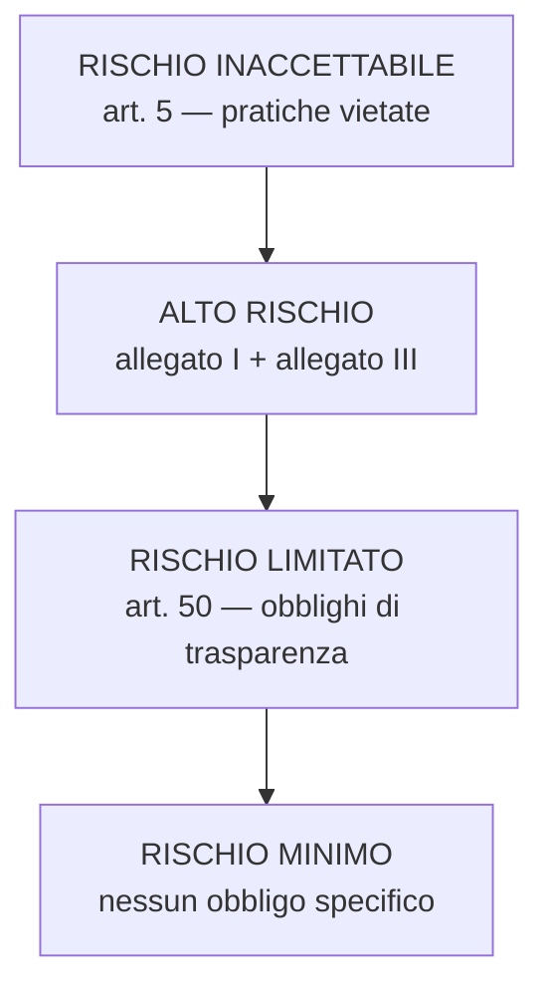

# 5 · Elementi di intelligenza artificiale

[← Indice](README.md)

> ⚠️ Materia in evoluzione: il **Reg. (UE) 2026/1744 "Digital Omnibus on AI"** (in vigore dal 27 luglio 2026)
> ha modificato alcuni aspetti dell'AI Act, in particolare il calendario dei sistemi ad alto rischio.
> I decreti attuativi della L. 132/2025 sono attesi entro il **10 ottobre 2026**. **Verifica prima della prova.**

## Mappa



## Concetti tecnici

- **IA debole** (compiti specifici) vs **IA forte** (ipotetica intelligenza generale).
- **Simbolica** (regole, sistemi esperti, logica) vs **sub-simbolica** (apprendimento da dati, reti neurali).
- **Reti neurali**: input layer → **hidden layer** → output; **pesi**, **funzione di attivazione**, **backpropagation**. **Deep learning** = reti con molti strati nascosti.

| Tipo di apprendimento | Dati | Compiti tipici |
|---|---|---|
| **Supervisionato** | Etichettati | **Classificazione**, **regressione** |
| **Non supervisionato** | Non etichettati | **Clustering**, riduzione della dimensionalità |
| **Semi-supervisionato** | Misti | — |
| **Per rinforzo** | Ricompense/penalità dall'ambiente | Politiche di azione, giochi, controllo |

- Dataset di **training / validazione / test**.
- **Overfitting**: ottimo sul training, pessimo su dati nuovi (modello troppo aderente al rumore). **Underfitting**: modello troppo semplice, scarso ovunque. Rimedi: più dati, regolarizzazione, **cross-validation**, early stopping.
- **Bias del dato** (dataset non rappresentativo) vs **bias algoritmico** (amplificato dal modello).

### Matrice di confusione e metriche ⭐

| | Predetto positivo | Predetto negativo |
|---|---|---|
| **Reale positivo** | TP (vero positivo) | FN (falso negativo) |
| **Reale negativo** | FP (falso positivo) | TN (vero negativo) |

```
Accuracy  = (TP + TN) / (TP + TN + FP + FN)
Precision = TP / (TP + FP)      quanto sono affidabili i positivi che dichiaro
Recall    = TP / (TP + FN)      quanti positivi reali riesco a catturare
F1        = 2 · (P · R) / (P + R)    media armonica
```

Con classi sbilanciate l'**accuracy inganna**: si guardano precision e recall.

- **NLP**, computer vision, sistemi di raccomandazione, robotica.
- **IA generativa e LLM**: **token**, parametri, **pre-training** e **fine-tuning**, **prompt engineering**, **RAG** (retrieval-augmented generation: risposte ancorate a documenti recuperati), **allucinazioni**, **temperatura** (casualità dell'output), finestra di **contesto**, **embedding**.
- **XAI** (spiegabilità), interpretabilità, **human-in-the-loop**, **human oversight**.

## AI Act — Regolamento (UE) 2024/1689

### Piramide del rischio



### Art. 5 — pratiche vietate

- Manipolazione subliminale o tecniche ingannevoli che distorcono il comportamento
- Sfruttamento delle **vulnerabilità** (età, disabilità, situazione sociale o economica)
- **Social scoring**
- **Polizia predittiva individuale** (rischio di reato basato solo su profilazione o tratti della personalità)
- **Scraping non mirato** di immagini facciali per creare banche dati di riconoscimento
- **Riconoscimento delle emozioni** sul luogo di lavoro e negli istituti di istruzione
- **Categorizzazione biometrica** basata su dati sensibili
- **Identificazione biometrica remota in tempo reale** in spazi accessibili al pubblico a fini di *law enforcement* (con **eccezioni tassative** e autorizzazione)

### Alto rischio

- **Allegato I**: prodotti soggetti a normativa di armonizzazione UE.
- **Allegato III**: **biometria · infrastrutture critiche · istruzione e formazione · occupazione e gestione dei lavoratori · accesso a servizi essenziali pubblici e privati · law enforcement · migrazione, asilo e controllo frontiere · amministrazione della giustizia e processi democratici**.

Obblighi (artt. 8-15 e ss.): sistema di **gestione dei rischi** · **data governance** · **documentazione tecnica** · **registrazione automatica dei log** · trasparenza verso i deployer · **sorveglianza umana** · accuratezza, robustezza e cybersicurezza · **valutazione di conformità** · **marcatura CE** · registrazione nella **banca dati UE**.
Per i **deployer pubblici**: **FRIA** — valutazione d'impatto sui **diritti fondamentali**.

### Ruoli

| Ruolo | Chi è |
|---|---|
| **Fornitore (provider)** | Sviluppa il sistema o lo immette sul mercato con il proprio nome |
| **Deployer (utilizzatore)** | Usa il sistema sotto la propria autorità (una PA che adotta un sistema IA è tipicamente deployer) |
| Importatore / Distributore | Soggetti della catena di fornitura |
| Rappresentante autorizzato | Per fornitori extra-UE |

### Altri articoli chiave

- **Art. 3** — definizioni (glossario utilissimo per i quiz).
- **Art. 4 — AI literacy**: obbligo per fornitori e deployer di garantire un **livello sufficiente di alfabetizzazione sull'IA** al personale.
- **Art. 50 — trasparenza**: informare quando si interagisce con un sistema di IA; **etichettare i contenuti sintetici**; rendere riconoscibili i **deepfake**.
- **GPAI** (modelli per finalità generali) e modelli con **rischio sistemico**; **codici di buone pratiche**.

### Governance e sanzioni

- **AI Office** della Commissione · **AI Board** · autorità nazionali di **notifica** e di **vigilanza del mercato** · **sandbox regolamentari**.
- Sanzioni fino a **35 milioni di euro o 7% del fatturato mondiale** per le **pratiche vietate**.

### Calendario di applicazione

| Data | Cosa si applica |
|---|---|
| **1 agosto 2024** | Entrata in vigore |
| **2 febbraio 2025** | **Divieti (art. 5)** e **AI literacy (art. 4)** |
| **2 agosto 2025** | **GPAI** e **governance** |
| **2 agosto 2026** | Applicazione **generale** |
| **2 agosto 2027** | Sistemi ad alto rischio dell'**allegato I** |

> Il **Digital Omnibus on AI (Reg. UE 2026/1744)** ha modificato in particolare il calendario dell'alto rischio: verifica lo stato aggiornato.

## Legge italiana sull'IA — L. 23 settembre 2025, n. 132

- **Principi**: approccio **antropocentrico**, trasparenza, proporzionalità, sicurezza, tutela dei diritti fondamentali, non discriminazione, sostenibilità.
- **Ambiti settoriali**: lavoro (con **Osservatorio sull'IA nel mondo del lavoro**), professioni intellettuali, sanità e disabilità, ricerca, **pubblica amministrazione**, giustizia, sicurezza nazionale, diritto d'autore.
- **IA nella PA**: uso **strumentale e di supporto**; **responsabilità e decisione restano in capo al funzionario**; **conoscibilità e tracciabilità** dell'uso.
- **Autorità nazionali**: **AgID** (promozione e sviluppo) e **ACN** (vigilanza e cybersicurezza); restano le competenze del **Garante privacy**.
- **Profili penali**: nuova fattispecie di **diffusione illecita di contenuti generati o alterati con IA (deepfake)**, punita con la **reclusione da 1 a 5 anni**; **circostanze aggravanti** per reati commessi mediante IA.
- **Investimenti**: fino a **1 miliardo di euro** dal Fondo di sostegno al venture capital (**art. 23**).
- **Deleghe (artt. 16 e 24)**: decreti legislativi entro il **10 ottobre 2026** su dati e algoritmi per l'addestramento, adeguamento all'AI Act, poteri delle autorità, sanzioni, formazione, responsabilità civile e penale.
  - CdM del **10 giugno 2026**, esame preliminare di due schemi: **A.G. n. 418** (IA nell'attività di polizia e responsabilità) e **A.G. n. 421** (poteri delle autorità nazionali e IA nella formazione). **Iter in corso: controlla lo stato.**

## IA nella pubblica amministrazione

- **Linee guida AgID** per l'adozione dell'IA nella PA; sezione dedicata del **Piano Triennale** (agg. 2026).
- **Art. 30 D.lgs. 36/2023** — procedure automatizzate nel ciclo di vita dei contratti pubblici: **conoscibilità**, **non esclusività** della decisione algoritmica, **non discriminazione** algoritmica.
- **Art. 22 GDPR**: divieto di decisioni **interamente automatizzate** con effetti giuridici o significativi, salvo eccezioni (consenso esplicito, contratto, legge), con diritto di ottenere l'**intervento umano**, esprimere la propria opinione e contestare.
- **Giurisprudenza amministrativa** (Cons. Stato, sez. VI, 2019-2020, trasferimenti dei docenti): principi di **conoscibilità, comprensibilità, non esclusività e non discriminazione** dell'algoritmo.
- Casi d'uso: chatbot e assistenti ai cittadini, classificazione documentale, analisi predittiva, supporto ai controlli, traduzione e sintesi.

## Trappole d'esame

- Il riconoscimento delle **emozioni** è vietato **sul lavoro e a scuola**, non ovunque.
- L'identificazione biometrica remota **in tempo reale** è vietata *per il law enforcement in spazi pubblici*, con eccezioni: non è un divieto assoluto.
- La PA che *usa* un sistema di IA è **deployer**, non fornitore. La **FRIA** è obbligo del **deployer pubblico**.
- **Divieti e AI literacy sono scattati per primi** (2 febbraio 2025), non insieme al resto.
- **Precision ≠ recall**: precision guarda i falsi positivi, recall i falsi negativi.
- **Overfitting** = va bene sul training, male sui dati nuovi (non il contrario).
- Nella L. 132/2025 **AgID promuove, ACN vigila**.

## Autoverifica

<details><summary>TP=40, FP=10, FN=20. Precision, recall, F1?</summary>

Precision = 40/50 = **0,8** · Recall = 40/60 ≈ **0,67** · F1 = 2·(0,8·0,67)/(0,8+0,67) ≈ **0,73**.
</details>

<details><summary>Un comune adotta un chatbot sviluppato da un fornitore esterno: che ruolo ha ai sensi dell'AI Act?</summary>

**Deployer**. Se il sistema rientra nell'allegato III, il comune deve tra l'altro garantire la **sorveglianza umana**, usarlo secondo le istruzioni del fornitore e, in quanto organismo pubblico, svolgere la **FRIA**.
</details>

<details><summary>Qual è il massimale sanzionatorio per le pratiche vietate?</summary>

**35 milioni di euro o il 7% del fatturato mondiale annuo**, a seconda di quale sia superiore.
</details>

<details><summary>I quattro principi elaborati dal Consiglio di Stato sull'uso dell'algoritmo?</summary>

**Conoscibilità, comprensibilità, non esclusività della decisione algoritmica, non discriminazione algoritmica.**
</details>

<details><summary>Che pena prevede la L. 132/2025 per la diffusione illecita di deepfake?</summary>

**Reclusione da 1 a 5 anni.**
</details>

## Fonti

- **Reg. (UE) 2024/1689 (AI Act)** — eur-lex: almeno artt. **3, 4, 5, 6, 8-15, 16, 26, 27, 50, 53, 55, 99** e **allegato III**
- **L. 132/2025** — normattiva.it
- Linee guida AgID sull'IA nella PA e Piano Triennale, sezione IA
- Dossier del Servizio Studi di Camera e Senato sull'AI Act e sulla L. 132/2025

## Checklist di padronanza

- [ ] Piramide del rischio e contenuto dell'art. 5
- [ ] Elenco degli ambiti dell'allegato III
- [ ] Obblighi dei sistemi ad alto rischio e FRIA
- [ ] Calendario AI Act (e verifica Digital Omnibus)
- [ ] Struttura della L. 132/2025 e ruoli AgID/ACN
- [ ] Metriche di valutazione e matrice di confusione
- [ ] Art. 22 GDPR + art. 30 D.lgs. 36/2023 + principi CdS
