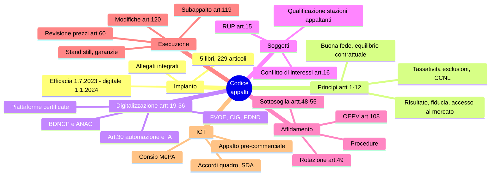

# 6 · Appalti pubblici — D.lgs. 31 marzo 2023, n. 36

[← Indice](README.md)

> Materia densa: qui si concentrano più errori che altrove.
> **Studia per istituti e per numeri** (soglie, termini, percentuali), non leggendo il codice dall'inizio alla fine.
> Usa sempre un **testo aggiornato**: il codice è stato modificato dal **D.lgs. 209/2024 (correttivo)** e da interventi successivi (fino alla legge di bilancio 2026 e alla L. 34/2026).

## Mappa

## Impianto e principi

- **5 libri, 229 articoli**, **allegati integrati al codice** (sostituiscono il vecchio sistema di linee guida e regolamenti attuativi: è la novità sistematica del 2023, "auto-esecutività").
- Efficacia dal **1° luglio 2023**; **digitalizzazione a regime dal 1° gennaio 2024**.

| Art. | Principio |
|---|---|
| **1** | **Risultato** — affidamento ed esecuzione con la massima tempestività e il miglior rapporto qualità/prezzo; criterio prioritario per esercitare la discrezionalità |
| **2** | **Fiducia** — reciproca fiducia nell'azione legittima, trasparente e corretta; valorizza l'iniziativa e l'autonomia decisionale dei funzionari |
| **3** | **Accesso al mercato** |
| **4** | **Criterio interpretativo e applicativo** — artt. 1, 2, 3 come chiave di lettura di tutto il codice |
| **5** | **Buona fede e tutela dell'affidamento** |
| **6** | Solidarietà e **sussidiarietà orizzontale** |
| **7** | **Auto-organizzazione amministrativa** (in house) |
| **8** | **Autonomia contrattuale** |
| **9** | **Conservazione dell'equilibrio contrattuale** |
| **10** | **Tassatività delle cause di esclusione** |
| **11** | Applicazione dei **CCNL** |

## Digitalizzazione del ciclo di vita (Libro I, Parte II, artt. 19-36) ⭐ nucleo del profilo

| Art. | Contenuto |
|---|---|
| **19** | Principi e diritti digitali; rispetto del **CAD**; neutralità tecnologica, trasparenza, protezione dei dati, sicurezza informatica |
| **23** | **BDNCP** — Banca dati nazionale dei contratti pubblici, gestita da **ANAC** |
| **25** | **Piattaforme di approvvigionamento digitale** certificate |
| **24** | **FVOE** — Fascicolo virtuale dell'operatore economico |
| **27** | **Pubblicità legale** degli atti tramite BDNCP; **CIG** rilasciato tramite piattaforma |
| **30** | **Procedure automatizzate e intelligenza artificiale** |
| **35-36** | Accesso agli atti e accesso civico; regime di **accesso digitale contestuale** alla comunicazione dell'aggiudicazione |

**Ecosistema nazionale di approvvigionamento digitale (e-procurement)**: BDNCP + piattaforme certificate + interoperabilità con la **PDND**.

L'**art. 30** riprende i principi dell'algoritmo: **conoscibilità**, **non esclusività** della decisione automatizzata, **non discriminazione algoritmica** → collegamento diretto con la materia 5.

## Soggetti

- **Stazione appaltante** ed **ente concedente**.
- **Qualificazione delle stazioni appaltanti** (**artt. 62-63** e **allegato II.4**): livelli di qualificazione, soglie entro cui si può procedere autonomamente, **elenco ANAC**; sotto soglia di qualificazione si ricorre a **centrali di committenza** o **soggetti aggregatori**.
- **RUP — Responsabile unico del progetto** (**art. 15** e **allegato I.2**): nominato per ogni intervento, per tutte le fasi; possibilità di nominare **responsabili di fase**.
- **Conflitto di interessi (art. 16)**: obbligo di comunicazione e astensione; la situazione deve essere *effettiva* e provata.

## Programmazione, progettazione, affidamento

- **Art. 37**: programma triennale dei **lavori** e programma triennale di **forniture e servizi**.
- **Art. 41**: livelli di progettazione ridotti a due — **PFTE** (progetto di fattibilità tecnico-economica) e **progetto esecutivo**.
- **Art. 43**: **BIM** obbligatorio sopra determinate soglie.

### Sottosoglia (artt. 48-55)

| Fattispecie | Regola |
|---|---|
| Servizi e forniture **< 140.000 €** | **Affidamento diretto**, anche senza consultazione di più operatori, con **motivazione** |
| Fasce superiori | **Procedura negoziata senza bando** con **5 o 10 operatori** a seconda della fascia |
| **Rotazione (art. 49)** | Divieto di affidare al contraente uscente nell'affidamento immediatamente successivo, per stesso settore/categoria; **eccezioni motivate** (es. struttura del mercato, riscontrata soddisfazione, indagini di mercato aperte) |
| Elenchi di operatori | Ammessi, con aggiornamento e trasparenza dei criteri |

> ⚠️ Le **soglie europee** sono aggiornate **ogni due anni** con regolamenti delegati della Commissione:
> impara i valori **vigenti al momento della prova** per amministrazioni centrali, altri enti, lavori e settori speciali.

### Procedure

Aperta · ristretta · competitiva con negoziazione · dialogo competitivo · **partenariato per l'innovazione** · **procedura negoziata senza pubblicazione** (art. 76, casi **tassativi**: infungibilità, estrema urgenza non imputabile, gara deserta…).

### Criteri di aggiudicazione (art. 108) ⭐

- Regola generale: **offerta economicamente più vantaggiosa (OEPV)**.
- **OEPV con rapporto qualità/prezzo obbligatoria** tra l'altro per i **servizi ad alta intensità di manodopera** e per i **servizi ad alto contenuto tecnologico/informatico** → rilevantissimo per gli acquisti ICT.
- **Minor prezzo** solo nei casi ammessi.
- **Tetto al punteggio economico: 30 punti** su 100.
- **CAM** — criteri ambientali minimi (**art. 57**) e **clausole sociali** (artt. 57 e 102).

Altri istituti: **offerte anomale** (art. 110), **commissione giudicatrice** (art. 93), **soccorso istruttorio** (art. 101), cause di esclusione **automatiche e non automatiche** (artt. 94-98), **illecito professionale grave**, **self-cleaning**.

## Esecuzione

| Istituto | Riferimento / numero |
|---|---|
| **Stand still** (termine dilatorio per la stipula) | **35 giorni**, art. 18 |
| Garanzie | artt. 106 (provvisoria) e 117 (definitiva) |
| **Subappalto** e subappalto **a cascata** | art. 119 |
| **Modifiche in corso di esecuzione** e **quinto d'obbligo** | art. 120 |
| **Revisione prezzi** — ora **obbligatoria** | art. 60 |
| **Collegio consultivo tecnico** | artt. 215-219 |

Più: direttore dell'esecuzione (DEC), collaudo e verifica di conformità, penali, risoluzione e recesso, accordo bonario, transazione, arbitrato.

## Strumenti tipici degli acquisti ICT ⭐

| Strumento | Riferimento / nota |
|---|---|
| **Accordo quadro** | art. 59 — definisce le condizioni di appalti successivi |
| **Sistema dinamico di acquisizione (SDA)** | art. 33 — procedura interamente elettronica, aperta per tutta la durata |
| Aste elettroniche, cataloghi elettronici | — |
| **Consip**, convenzioni, **MePA**, accordi quadro **Digital Transformation** | Obbligo di ricorso a Consip/soggetti aggregatori per **beni e servizi informatici e di connettività**: **art. 1, comma 512, L. 208/2015** |
| **Appalto pre-commerciale** e **partenariato per l'innovazione** | Acquisto di soluzioni innovative / R&S |
| Linee guida AgID su acquisizione e riuso del software | **Valutazione comparativa obbligatoria: artt. 68-69 CAD** |

## Contenzioso e vigilanza

- **ANAC**: vigilanza, **precontenzioso**, pareri, **casellario informatico**, **bandi-tipo**.
- **Rito appalti — art. 120 c.p.a.**: termini brevi, informativa in ordine all'intento di proporre ricorso.

## Trappole d'esame

- **140.000 €** è la soglia dell'affidamento diretto per **servizi e forniture** (i lavori hanno soglia propria).
- La **rotazione** ammette eccezioni motivate: non è un divieto assoluto.
- Il **punteggio economico** ha un tetto di **30 punti**, non è libero.
- Per i **servizi informatici** l'OEPV qualità/prezzo è **obbligatoria**: attenzione ai quiz che propongono il minor prezzo.
- Gli **allegati sono parte del codice**: non sono più linee guida attuative separate.
- **RUP = responsabile unico del *progetto***, non più "del procedimento".
- La **revisione prezzi** è oggi **obbligatoria** (art. 60), non facoltativa.
- **Stand still 35 giorni**: non confonderlo con i termini del rito processuale.

## Autoverifica

Quali sono i tre principi "cardine" e quale articolo ne fa criterio interpretativo?

**Risultato (art. 1), fiducia (art. 2), accesso al mercato (art. 3)**; l'**art. 4** stabilisce che costituiscono criterio interpretativo e applicativo dell'intero codice.

Una PA deve acquistare un servizio applicativo da 90.000 €. Che procedura può usare?

**Affidamento diretto** ex art. 50 (servizi e forniture sotto 140.000 €), anche senza consultazione di più operatori, con **motivazione** e nel rispetto della **rotazione**, previa verifica degli strumenti Consip/MePA obbligatori per i beni e servizi informatici.

Che cos'è il FVOE e a cosa serve?

Il **Fascicolo virtuale dell'operatore economico**: raccoglie in modalità digitale i dati e i documenti per la verifica dei requisiti, evitando di richiederli a ogni gara.

Quali principi impone l'art. 30 all'uso di procedure automatizzate?

**Conoscibilità** della logica, **non esclusività** della decisione algoritmica (deve esserci un contributo umano), **non discriminazione algoritmica**, con misure di verifica e correzione.

Qual è la durata del termine dilatorio per la stipula?

**35 giorni** dall'invio dell'ultima comunicazione del provvedimento di aggiudicazione (art. 18), salvo le eccezioni previste.

## Fonti

- **D.lgs. 36/2023 aggiornato** — normattiva.it, bosettiegatti.eu (testo coordinato con note), codiceappalti.it
- [ANAC — anticorruzione.it](https://www.anticorruzione.it): delibere, bandi-tipo, comunicati del Presidente
- MIT — Servizio contratti pubblici; portale della digitalizzazione degli appalti di ANAC
- Piano Triennale, capitolo **procurement**

## Checklist di padronanza

- [ ] Principi artt. 1-11 con numero di articolo
- [ ] Artt. 19-36: chi fa cosa nella digitalizzazione
- [ ] Soglia 140.000 € e regole della procedura negoziata sottosoglia
- [ ] Soglie europee **vigenti alla data della prova**
- [ ] Art. 108: quando l'OEPV è obbligatoria + tetto 30 punti
- [ ] Numeri dell'esecuzione (35 gg, quinto d'obbligo, revisione prezzi)
- [ ] Strumenti ICT: accordo quadro, SDA, Consip, comma 512
