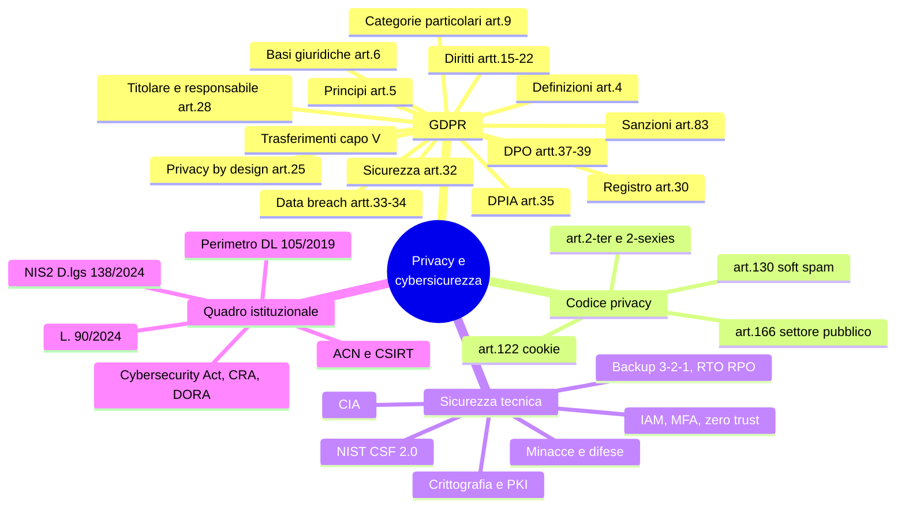

# 7 · Privacy, sicurezza dei dati e cybersicurezza

[← Indice](README.md)

## Mappa

## GDPR — Reg. (UE) 2016/679

### Principi (art. 5)

1. **Liceità, correttezza, trasparenza**
2. **Limitazione della finalità**
3. **Minimizzazione**
4. **Esattezza**
5. **Limitazione della conservazione**
6. **Integrità e riservatezza**
7. **Accountability** (responsabilizzazione) — comma 2: il titolare deve **poter dimostrare** il rispetto degli altri sei

### Basi giuridiche (art. 6) ⭐

| Base | Nota per la PA |
|---|---|
| Consenso | Raramente idoneo nel rapporto con l'autorità pubblica (squilibrio di potere) |
| Contratto | — |
| Obbligo legale | Frequente |
| Interesse vitale | Residuale |
| **Compito di interesse pubblico o esercizio di pubblici poteri** | **La base tipica della PA** (art. 6.1.e) |
| Legittimo interesse | **Non invocabile dalle autorità pubbliche nell'esercizio dei loro compiti** |

- **Art. 9**: categorie particolari (origine razziale/etnica, opinioni politiche, convinzioni religiose, appartenenza sindacale, dati genetici, **biometrici** per identificazione univoca, salute, vita/orientamento sessuale) → divieto salvo eccezioni.
- **Art. 10**: dati relativi a condanne penali e reati.

### Diritti dell'interessato (artt. 15-22)

Accesso · rettifica · **cancellazione/oblio** · limitazione · **portabilità** · opposizione · **art. 22** decisioni automatizzate e profilazione.
**Termine di riscontro: 1 mese**, prorogabile di **2 mesi** in casi complessi (dandone notizia entro il primo mese).

### Ruoli e adempimenti

| Istituto | Articolo | Contenuto |
|---|---|---|
| Contitolari | 26 | Accordo interno sulle rispettive responsabilità |
| **Responsabile del trattamento** | **28** | Nominato con **contratto o altro atto giuridico**; sub-responsabili con autorizzazione del titolare |
| **Privacy by design e by default** | **25** | Protezione dalla progettazione e per impostazione predefinita |
| **Registro dei trattamenti** | **30** | Obbligatorio per le **autorità pubbliche** |
| **Misure di sicurezza** | **32** | Adeguate al rischio; pseudonimizzazione, cifratura, resilienza, test periodici |
| **Data breach — notifica al Garante** | **33** | Entro **72 ore** dalla conoscenza, salvo improbabilità del rischio; **registro delle violazioni** |
| **Data breach — comunicazione all'interessato** | **34** | **Senza ingiustificato ritardo** se **rischio elevato** |
| **DPIA** | **35** | Quando il trattamento può presentare un **rischio elevato** |
| **Consultazione preventiva** | **36** | Se la DPIA indica rischio elevato non mitigabile |
| **DPO / RPD** | **37-39** | **Obbligatorio per le autorità e organismi pubblici**; conoscenza specialistica, indipendenza, no conflitto di interessi, riporta al vertice |

- **Trasferimenti extra-UE (capo V)**: decisioni di adeguatezza, **clausole contrattuali standard (SCC)**, **norme vincolanti d'impresa (BCR)**, deroghe; **EU-US Data Privacy Framework**.
- **Sanzioni (art. 83)**: fino a **10 mln / 2%** oppure **20 mln / 4%** del fatturato mondiale; per il **settore pubblico italiano** regime specifico ex **art. 166 Codice privacy**.
- Autorità di controllo, **sportello unico** (one-stop-shop), **EDPB**.

## Normativa nazionale

**D.lgs. 196/2003** come modificato dal **D.lgs. 101/2018**:

| Articolo | Contenuto |
|---|---|
| **2-ter** | Base giuridica del trattamento in ambito pubblico |
| **2-sexies** | Motivi di **interesse pubblico rilevante** per le categorie particolari |
| **122** | **Cookie** e strumenti di tracciamento |
| **130** | Comunicazioni indesiderate; **comma 4 = soft spam** |
| **166** | Sanzioni, regime per il settore pubblico |

Provvedimenti del Garante da conoscere: **linee guida cookie (2021)**, documento di indirizzo sui **metadati delle email dei lavoratori**, provvedimenti su sistemi di IA e su **data breach nel settore pubblico**.
**Trasparenza vs privacy**: bilanciamento fra D.lgs. 33/2013 e GDPR — **Linee guida del Garante n. 243/2014**.

## Sicurezza dei dati e dei sistemi

- **Triade CIA**: **C**onfidentiality (riservatezza) · **I**ntegrity (integrità) · **A**vailability (disponibilità). Proprietà aggiuntive: autenticità, **non ripudio**, tracciabilità.
- **Crittografia**: simmetrica (una chiave, veloce) vs **asimmetrica** (chiave pubblica/privata); **funzioni di hash** (unidirezionali, a lunghezza fissa); **PKI**, certificati digitali, firma digitale, TLS/HTTPS.
- **IAM**: autenticazione (chi sei) vs autorizzazione (cosa puoi fare); **MFA**, SSO; **minimo privilegio** e **need-to-know**; **segregazione dei compiti**; **zero trust** ("mai fidarsi, verificare sempre").
- **Continuità operativa**: **backup 3-2-1** (3 copie, 2 supporti diversi, 1 off-site); disaster recovery; **RTO** = tempo massimo di ripristino accettabile; **RPO** = massima perdita di dati accettabile (quanto indietro si torna); business continuity plan; esercitazioni.

### Minacce

Malware · **ransomware** (e **doppia estorsione**: cifratura + minaccia di pubblicazione) · phishing, **spear phishing** (mirato), **smishing** (SMS), **vishing** (voce) · **BEC** (business email compromise) · social engineering · **DDoS** · **SQL injection** · **XSS** · **man-in-the-middle** · attacchi alla **supply chain** · **zero-day** · **APT** · **insider threat**.

### Difese

Firewall · **IDS/IPS** · **SIEM** · **EDR** · segmentazione di rete · **patch management** · **vulnerability assessment** e **penetration test** (il primo individua e classifica, il secondo prova a sfruttare) · gestione dei log · **security awareness**.

### Framework

- **NIST Cybersecurity Framework 2.0** — 6 funzioni: **GOVERN** (novità della 2.0) · **IDENTIFY** · **PROTECT** · **DETECT** · **RESPOND** · **RECOVER**.
- **ISO/IEC 27001** (requisiti certificabili dell'ISMS) e **27002** (controlli).
- **Framework Nazionale per la Cybersecurity e la Data Protection** (CINI).
- **Misure minime AgID (ABSC)** per la sicurezza ICT delle PA.

## Quadro istituzionale ⭐ molto probabile

| Fonte | Contenuto chiave | Termini |
|---|---|---|
| **DL 82/2021 conv. L. 109/2021** | Istituisce l'**ACN — Agenzia per la cybersicurezza nazionale**; **CSIRT Italia**; **Nucleo per la cybersicurezza**; Strategia nazionale di cybersicurezza | — |
| **Perimetro di sicurezza nazionale cibernetica — DL 105/2019 conv. L. 133/2019** + DPCM attuativi | Soggetti inclusi, elenco beni ICT, **scrutinio tecnologico del CVCN** | **Notifica incidenti entro 6 ore** |
| **NIS2 — Dir. (UE) 2022/2555**, recepita con **D.lgs. 4 settembre 2024, n. 138** | Ambito ampliato; **soggetti essenziali e importanti**; registrazione sulla piattaforma ACN; obblighi di gestione del rischio (**art. 24**); responsabilità e **formazione degli organi di amministrazione**; sanzioni | **Art. 25**: pre-notifica **24 h** → notifica **72 h** → relazione finale **1 mese** |
| **L. 28 giugno 2024, n. 90** | Rafforzamento della cybersicurezza nazionale: obblighi per le PA, **referente per la cybersicurezza**, rapporti con ACN, inasprimento dei reati informatici, obblighi di **crittografia**, **elementi essenziali di cybersicurezza nei contratti ICT** | Segnalazione **24 h / 72 h** |
| **Cybersecurity Act — Reg. (UE) 2019/881** | ENISA e **schemi europei di certificazione** | — |
| **Cyber Resilience Act — Reg. (UE) 2024/2847** | Requisiti di sicurezza dei prodotti con elementi digitali | — |
| **DORA — Reg. (UE) 2022/2554** | Resilienza operativa digitale del **settore finanziario** | — |

**Reati informatici**: artt. **615-ter** e ss. c.p. (accesso abusivo a sistema informatico), danneggiamento di sistemi, **frode informatica art. 640-ter**; responsabilità degli enti ex **D.lgs. 231/2001**.

## I termini di notifica a confronto ⭐ domanda quasi certa

| Contesto | Termine | A chi |
|---|---|---|
| **Data breach GDPR** | **72 ore** | Garante privacy |
| Data breach con rischio elevato | Senza ingiustificato ritardo | Interessati |
| **Perimetro di sicurezza nazionale cibernetica** | **6 ore** | CSIRT Italia |
| **NIS2 — pre-notifica** | **24 ore** | CSIRT Italia / ACN |
| **NIS2 — notifica** | **72 ore** | CSIRT Italia / ACN |
| **NIS2 — relazione finale** | **1 mese** | CSIRT Italia / ACN |

## Trappole d'esame

- La **notifica al Garante** è entro 72 ore; la **comunicazione all'interessato** non ha un termine in ore ma è "senza ingiustificato ritardo" e solo se il rischio è **elevato**.
- Il **legittimo interesse** non è utilizzabile dalle autorità pubbliche nell'esercizio dei loro compiti.
- Il **DPO è obbligatorio** per le autorità pubbliche sempre, non solo in base al tipo di trattamento.
- **RTO = tempo**, **RPO = dati**. Si invertono facilmente.
- **6 ore** è il Perimetro, **24 ore** è NIS2: non confonderli.
- **Vulnerability assessment ≠ penetration test**.
- NIST CSF **2.0** ha **6** funzioni: la nuova è **GOVERN**.
- **ACN vigila sulla cybersicurezza**, il **Garante** sui dati personali: competenze distinte, possono concorrere sullo stesso incidente.

## Autoverifica

Una PA subisce un ransomware con esfiltrazione di dati dei dipendenti. Quali notifiche?

**GDPR art. 33**: notifica al **Garante entro 72 ore**; **art. 34**: comunicazione **agli interessati** se il rischio per i loro diritti è **elevato** (qui verosimilmente sì). Se la PA è soggetto NIS2: **pre-notifica entro 24 h**, **notifica entro 72 h**, **relazione finale entro 1 mese** al CSIRT/ACN. Se inclusa nel Perimetro: **6 ore**. In ogni caso annotazione nel **registro delle violazioni**.

Qual è la base giuridica tipica del trattamento svolto da un ministero?

**Art. 6.1.e GDPR** — esecuzione di un compito di interesse pubblico o connesso all'esercizio di pubblici poteri, integrata dall'**art. 2-ter** del Codice privacy.

Che cosa significa backup 3-2-1?

**3 copie** dei dati, su **2 tipi di supporto** diversi, di cui **1 conservata off-site** (fuori sede).

Quali sono le 6 funzioni del NIST CSF 2.0?

**Govern, Identify, Protect, Detect, Respond, Recover.**

Quando è obbligatoria la DPIA?

Quando il trattamento, per natura, oggetto, contesto e finalità, può presentare un **rischio elevato** per i diritti e le libertà: in particolare valutazioni sistematiche basate su trattamento automatizzato, trattamenti su larga scala di categorie particolari, sorveglianza sistematica su larga scala di zone accessibili al pubblico; più l'elenco delle tipologie individuato dal Garante italiano.

## Fonti

- **GDPR** — eur-lex.europa.eu · **D.lgs. 196/2003** — normattiva.it
- [garanteprivacy.it](https://www.garanteprivacy.it) — sezione "Temi": cookie, DPIA, DPO, data breach, FAQ per la PA
- [acn.gov.it](https://www.acn.gov.it) — NIS2 e FAQ, Strategia nazionale, CSIRT
- **D.lgs. 138/2024** e **L. 90/2024** — normattiva.it
- NIST CSF 2.0; Framework Nazionale Cybersecurity (CINI)

## Checklist di padronanza

- [ ] 7 principi art. 5 e 6 basi giuridiche art. 6
- [ ] Tabella articoli GDPR ↔ adempimenti
- [ ] Tabella dei termini di notifica (6/24/72 ore, 1 mese)
- [ ] Diritti dell'interessato e termini di riscontro
- [ ] Triade CIA, RTO/RPO, backup 3-2-1
- [ ] Glossario minacce e difese
- [ ] ACN, CSIRT, Perimetro, NIS2, L. 90/2024
