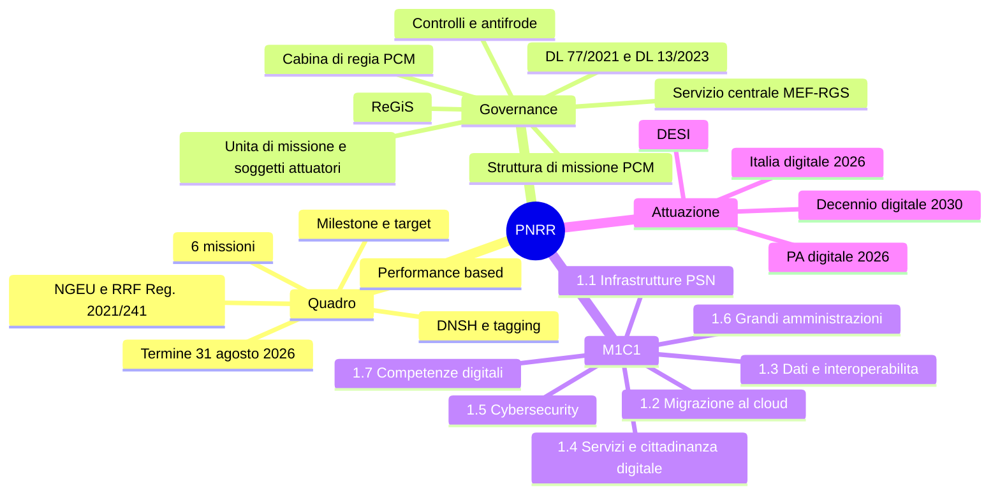

# 8 · PNRR e misure sulla digitalizzazione

[← Indice](README.md)

## Mappa

## Quadro generale

- **Next Generation EU** e **dispositivo per la ripresa e la resilienza (RRF)** — **Reg. (UE) 2021/241**.
- Natura **performance-based**: i fondi si erogano al raggiungimento di **milestone** (traguardi **qualitativi**) e **target** (obiettivi **quantitativi**), **non** a fronte di spesa rendicontata. È la differenza strutturale con i fondi strutturali classici.
- PNRR italiano approvato dal Consiglio il **13 luglio 2021**: **6 missioni**, dotazione iniziale **~191,5 miliardi** (**68,9** sovvenzioni + **122,6** prestiti), poi rimodulata con l'aggiunta del capitolo **REPowerEU** → risorse complessive **~194,4 miliardi**.
- Principi trasversali: **DNSH** (*Do No Significant Harm*), **tagging climatico e digitale** (almeno il **20% al digitale**), addizionalità, parità di genere, giovani, riequilibrio territoriale (**quota Mezzogiorno**).
- **Termine di completamento: 31 agosto 2026**, con successiva fase di rendicontazione e richiesta di pagamento finale.
- **Sesta revisione** approvata dal Consiglio UE il **27 novembre 2025**: definanziamenti e riallocazioni per **~14 miliardi** verso misure più rapidamente realizzabili; la **Missione 1 principale beneficiaria**.

## Governance

- **DL 77/2021 conv. L. 108/2021** e **DL 13/2023 conv. L. 41/2023** (riforma della governance).

| Organismo | Sede | Ruolo |
|---|---|---|
| **Cabina di regia** | **PCM** | Indirizzo politico, impulso, monitoraggio |
| **Struttura di missione PNRR** | **PCM** | Supporto operativo, coordinamento |
| **Servizio centrale per il PNRR** | **MEF – RGS** | Punto di contatto con la Commissione, coordinamento gestionale, ReGiS |
| **Ispettorato generale per il PNRR** | MEF | — |
| **Unità di missione** | Ogni amministrazione titolare | Attuazione delle misure di competenza |
| **Soggetti attuatori** | Enti territoriali, scuole, ASL, ecc. | Realizzazione degli interventi |

- **ReGiS**: sistema informativo unitario per **monitoraggio, rendicontazione e controllo**.
- Controlli: **Unità di audit MEF**, **Corte dei conti**, **Commissione europea**, **OLAF**, **EPPO**. Presidio **antifrode**, **conflitto di interessi**, **doppio finanziamento**.
- **Obblighi di informazione, comunicazione e visibilità** — **art. 34 Reg. 2021/241**: emblema UE e dicitura **"Finanziato dall'Unione europea – NextGenerationEU"**.

## Missione 1, Componente 1 — "Digitalizzazione, innovazione e sicurezza nella PA" ⭐

| Investimento | Contenuto |
|---|---|
| **1.1 Infrastrutture digitali** | **Polo Strategico Nazionale (PSN)**, data center, classificazione di dati e servizi |
| **1.2 Abilitazione e facilitazione della migrazione al cloud** | Avvisi per PA centrali e locali, ASL e aziende ospedaliere |
| **1.3 Dati e interoperabilità** | **PDND**, **ANPR**, riuso, **once-only** |
| **1.4 Servizi digitali e cittadinanza digitale** | **App IO**, **pagoPA**, **SPID/CIE**, esperienza del cittadino (avvisi per comuni e scuole), **SEND**, adozione dell'identità digitale |
| **1.5 Cybersecurity** | Rafforzamento dell'**ACN**, servizi di sicurezza nazionali, protezione delle PA |
| **1.6 Digitalizzazione delle grandi amministrazioni centrali** | — |
| **1.7 Competenze digitali di base** | **Servizio civile digitale**, **Rete dei servizi di facilitazione digitale**, **Fondo per la Repubblica Digitale** |

**Riforme collegate**: PA digitale e **cloud first**; supporto alla trasformazione (unità di missione, **RTD**); **interoperabilità e once-only**; semplificazione dei procedimenti; riforma del **pubblico impiego e del reclutamento**; **riforma degli appalti pubblici**.

## Strumenti attuativi

- **PA digitale 2026** ([padigitale2026.gov.it](https://padigitale2026.gov.it)): avvisi, **voucher**, misure per comuni, scuole, ASL. Il **DTD è amministrazione titolare**.
- **Strategia "Italia digitale 2026"** e target: identità digitale, servizi pubblici online, PA in cloud, competenze digitali.
- Coerenza con il **Decennio Digitale 2030 — Decisione (UE) 2022/2481** e con il **DESI**.
- Risultati e criticità: bene su **fibra e 5G**, **cloud**, digitalizzazione delle **PMI**; ritardi segnalati su **fascicolo sanitario elettronico**, **pagamenti digitali**, **aree rurali e montane**.

## Trappole d'esame

- **Milestone = qualitativi**, **target = quantitativi**.
- Il PNRR è **performance-based**: non si rendiconta la spesa, si dimostra il raggiungimento di M&T.
- **Cabina di regia e Struttura di missione = PCM**; **Servizio centrale = MEF-RGS**. Domanda ricorrente.
- Il **20%** è la quota **digitale**; non confonderla con la quota climatica (37%) né con la quota Mezzogiorno (40%).
- **PSN = investimento 1.1**; **PDND/ANPR = 1.3**; **IO/pagoPA/SEND = 1.4**; **cybersecurity = 1.5**; **competenze = 1.7**.
- Il **DNSH** è un principio trasversale di *non arrecare danno significativo* all'ambiente, non un criterio di premialità.

## Autoverifica

Qual è la differenza operativa fra milestone e target?

La **milestone** è un traguardo **qualitativo** (es. entrata in vigore di una riforma, pubblicazione di un avviso); il **target** è un obiettivo **quantitativo** misurabile (es. numero di amministrazioni migrate in cloud). Entrambi condizionano l'erogazione delle rate.

Dove si collocano PDND e ANPR nel PNRR?

**M1C1, investimento 1.3 — Dati e interoperabilità**, funzionale al principio **once-only**.

Chi gestisce ReGiS e a cosa serve?

È il sistema informativo unitario in capo al **MEF-RGS (Servizio centrale per il PNRR)** per monitoraggio, rendicontazione e controllo di tutte le misure; i soggetti attuatori vi caricano dati fisici, procedurali e finanziari.

Quale articolo impone gli obblighi di visibilità e quale dicitura va usata?

**Art. 34 del Reg. (UE) 2021/241**; emblema UE e dicitura **"Finanziato dall'Unione europea – NextGenerationEU"**.

Qual è la data di completamento del PNRR?

**31 agosto 2026**, seguita dalla fase di rendicontazione e richiesta di pagamento finale.

## Fonti

- [italiadomani.gov.it](https://www.italiadomani.gov.it) — testo del Piano, missioni, schede misura, relazioni al Parlamento
- [innovazione.gov.it](https://innovazione.gov.it) — "Italia digitale 2026 – attuazione misure PNRR"
- [padigitale2026.gov.it](https://padigitale2026.gov.it) — misure, avvisi, target
- **Reg. (UE) 2021/241** — eur-lex · **DL 77/2021** e **DL 13/2023** — normattiva.it
- Relazione sullo stato di attuazione del PNRR; **dossier del Servizio Studi di Camera e Senato** (sintesi ottime e gratuite)

## Checklist di padronanza

- [ ] Numeri del Piano (191,5 / 194,4 / 68,9 / 122,6 / 6 missioni / 20% digitale)
- [ ] Chi fa cosa nella governance
- [ ] I sette investimenti M1C1 a memoria
- [ ] Milestone vs target e ruolo di ReGiS
- [ ] Obblighi di comunicazione art. 34
- [ ] Italia digitale 2026 ↔ Decennio Digitale 2030 ↔ DESI
