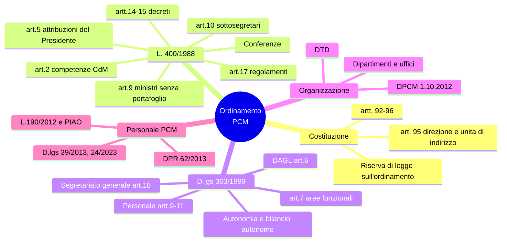

# 9 · Ordinamento della Presidenza del Consiglio dei ministri

[← Indice](README.md)

> Materia relativamente circoscritta e con risposte secche:
> **il blocco con il miglior rapporto fra ore di studio e punti ottenibili.** Non trascurarlo.

## Mappa

## Base costituzionale (artt. 92-96)

| Art. | Contenuto |
|---|---|
| **92** | Il Governo è composto dal **Presidente del Consiglio e dai ministri**, che insieme costituiscono il **Consiglio dei ministri**. Il **Presidente della Repubblica nomina il Presidente del Consiglio** e, su proposta di questo, i ministri |
| **93** | **Giuramento** nelle mani del Presidente della Repubblica |
| **94** | **Fiducia** delle due Camere; mozione motivata e votata per appello nominale |
| **95** | Il Presidente del Consiglio **dirige la politica generale del Governo e ne è responsabile**; **mantiene l'unità di indirizzo politico e amministrativo**, **promuovendo e coordinando l'attività dei ministri**. I ministri sono responsabili **collegialmente** degli atti del CdM e **individualmente** degli atti dei loro dicasteri. **Comma 3: riserva di legge** sull'ordinamento della Presidenza |
| **96** | Reati ministeriali: giurisdizione ordinaria previa autorizzazione di Camera o Senato |

## Legge 23 agosto 1988, n. 400

| Art. | Contenuto |
|---|---|
| **2** | Competenze del **Consiglio dei ministri** (atti sottoposti a deliberazione collegiale) |
| **5** | **Attribuzioni del Presidente del Consiglio**: indirizza ai ministri **direttive**, coordina l'attività, può **sospendere l'adozione di atti** da parte dei ministri sottoponendoli al CdM, promuove **verifiche**, concorda le dichiarazioni pubbliche impegnative per la politica generale |
| **9** | **Ministri senza portafoglio** |
| **10** | **Sottosegretari di Stato** e **viceministri**; delega di funzioni |
| **14-15** | **Decreti legislativi** e **decreti-legge** |
| **17** | **Potestà regolamentare del Governo**: regolamenti di **esecuzione**, di **attuazione e integrazione**, **indipendenti**, di **delegificazione** (comma 2), di **organizzazione**, **ministeriali** (comma 3) |
| **19** | Strutture della Presidenza |
| **21** | Organizzazione |
| **12 e ss.** | **Conferenza Stato-Regioni** e **Conferenza unificata** (con il **D.lgs. 281/1997**) |

## D.lgs. 30 luglio 1999, n. 303 — l'atto chiave

- Emanato in attuazione della delega della **L. 59/1997** (riforma **Bassanini**); è lo **speculare** del **D.lgs. 300/1999** sui ministeri.
- **Autonomia** organizzativa, contabile e di bilancio della Presidenza: **bilancio autonomo (art. 8)** e regolamento di contabilità proprio.

| Art. | Contenuto |
|---|---|
| **6** | **DAGL** — Dipartimento per gli affari giuridici e legislativi: coordinamento dell'attività normativa, **AIR**, qualità della regolazione |
| **7** | Il Presidente individua **con propri decreti** le **aree funzionali**, le strutture di cui si avvalgono ministri e sottosegretari delegati, il **numero massimo** di uffici e servizi |
| **8** | **Bilancio autonomo** |
| **9-11** | **Personale**: **ruolo autonomo** della Presidenza, personale a contratto e in **comando/fuori ruolo**, **contrattazione collettiva propria** |
| **18** | **Segretariato generale** e **Segretario generale**: nomina, supporto al Presidente, responsabilità della gestione |

Con la riforma, parte delle funzioni della Presidenza è stata **trasferita ad altre amministrazioni**, per concentrare la PCM sulle funzioni di **indirizzo e coordinamento**.

## Atti di organizzazione

- **DPCM 1° ottobre 2012 e s.m.i.**: ordinamento delle **strutture generali** della Presidenza, con individuazione di dipartimenti, uffici e competenze.
- Decreti del **Segretario generale** e dei ministri/sottosegretari delegati per l'organizzazione interna.

**Principali strutture da saper elencare**: Segretariato generale · **DAGL** · Dipartimento per il coordinamento amministrativo · **DIPE** (programmazione e coordinamento della politica economica) · Dipartimento della **funzione pubblica** · Dipartimento per le **politiche europee** · Dipartimento della **protezione civile** · Dipartimento per l'**informazione e l'editoria** · Dipartimento per lo **sport** · Dipartimento per le **politiche della famiglia** · Dipartimento per le **politiche di coesione** · **Dipartimento per la trasformazione digitale** · uffici del Segretariato generale.

## Il Dipartimento per la trasformazione digitale (DTD) ⭐

- **Missione**: struttura di supporto al Presidente del Consiglio (o al ministro/sottosegretario delegato) nella **promozione e nel coordinamento delle azioni di Governo** per la strategia unitaria di trasformazione digitale e modernizzazione del Paese.
- Rapporti con **AgID** (agenzia tecnica vigilata) e con l'**ACN**; direzione e coordinamento delle **società in house** rilevanti (**PagoPA S.p.A.**, **Sogei** per le parti di competenza).
- **CITD — Comitato interministeriale per la transizione digitale**: **art. 8 del DL 22/2021 conv. L. 55/2021**.
- **Amministrazione titolare** di misure PNRR della **M1C1**; responsabile del **Piano Triennale** insieme ad **AgID** (art. 14-bis CAD).

## Disciplina del personale della PCM

| Fonte | Contenuto |
|---|---|
| **DPR 62/2013** | Codice di comportamento dei dipendenti pubblici + **codice di comportamento specifico della PCM**; per l'accesso alla Presidenza è richiesta **condotta incensurabile** |
| **L. 190/2012** | Anticorruzione; **PNA** e **PTPCT** confluito nel **PIAO** |
| **D.lgs. 33/2013** | Trasparenza |
| **D.lgs. 150/2009** | Ciclo della performance |
| **D.lgs. 165/2001** | Lavoro pubblico, per i profili non derogati |
| **D.lgs. 39/2013** | Inconferibilità e incompatibilità di incarichi |
| **D.lgs. 24/2023** | **Whistleblowing** |

## Trappole d'esame

- L'art. 95 Cost. dice che il Presidente **dirige** la politica generale e **coordina** l'attività dei ministri: non "sovraordina". I ministri restano responsabili individualmente dei propri dicasteri.
- **Art. 5 L. 400/1988** = attribuzioni del **Presidente**; **art. 2** = competenze del **Consiglio**.
- L'**art. 17** è la norma sui **regolamenti**: sapere distinguere i regolamenti di **delegificazione** (comma 2) da quelli **ministeriali** (comma 3, non possono dettare norme contrarie a quelli governativi).
- Il **D.lgs. 303/1999** è del **1999** come il 300/1999 sui ministeri, entrambi figli della **L. 59/1997**.
- Il **Segretario generale** è disciplinato dall'**art. 18** del D.lgs. 303/1999.
- La PCM ha **bilancio autonomo** e **ruolo autonomo del personale**: è la sua specificità rispetto ai ministeri.
- Il **CITD** nasce con il **DL 22/2021**, non con il CAD.

## Autoverifica

Chi nomina il Presidente del Consiglio e chi i ministri?

Il **Presidente della Repubblica** nomina il Presidente del Consiglio e, **su proposta di questo**, i ministri (art. 92 Cost.).

Cosa prevede l'art. 5 della L. 400/1988 in caso di atto di un ministro non conforme all'indirizzo?

Il Presidente del Consiglio può **sospendere l'adozione di atti** da parte dei ministri competenti in ordine a questioni politiche e amministrative, sottoponendoli al **Consiglio dei ministri** nella riunione immediatamente successiva.

Quale articolo del D.lgs. 303/1999 disciplina il Segretariato generale?

L'**art. 18**.

Con quale atto nasce il CITD e quale articolo lo prevede?

**DL 22/2021 (conv. L. 55/2021), art. 8**.

Quali sono i rapporti fra DTD, AgID e ACN?

Il DTD è la struttura della PCM che promuove e coordina l'azione di Governo sulla trasformazione digitale; **AgID** è l'agenzia tecnica vigilata che redige con il DTD il Piano Triennale e le linee guida; l'**ACN** è l'autorità per la cybersicurezza nazionale (cui è passata anche la qualificazione dei servizi cloud).

## Fonti

- [governo.it](https://www.governo.it) — "Organizzazione → Norme e ordinamento" e organigramma aggiornato
- **L. 400/1988** e **D.lgs. 303/1999** — normattiva.it (testi brevi: leggerli per intero conviene)
- **DPCM 1° ottobre 2012** e s.m.i. — governo.it / presidenza.governo.it
- [innovazione.gov.it](https://innovazione.gov.it) — Dipartimento, competenze, struttura
- **Amministrazione trasparente della PCM** — organigramma attuale

## Checklist di padronanza

- [ ] Artt. 92-96 Cost. a memoria, con il contenuto dell'art. 95
- [ ] Tabella articoli L. 400/1988
- [ ] D.lgs. 303/1999: autonomia, art. 7, art. 18, DAGL, personale
- [ ] Elenco dei dipartimenti della PCM
- [ ] Missione del DTD e rapporti con AgID/ACN/PagoPA S.p.A.
- [ ] CITD e base normativa
- [ ] Codice di comportamento e normativa sul personale PCM
